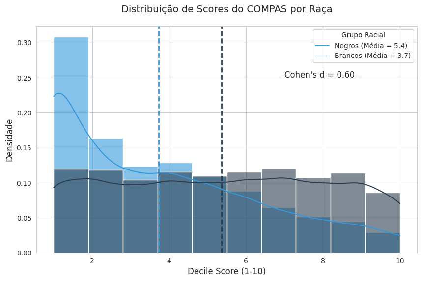
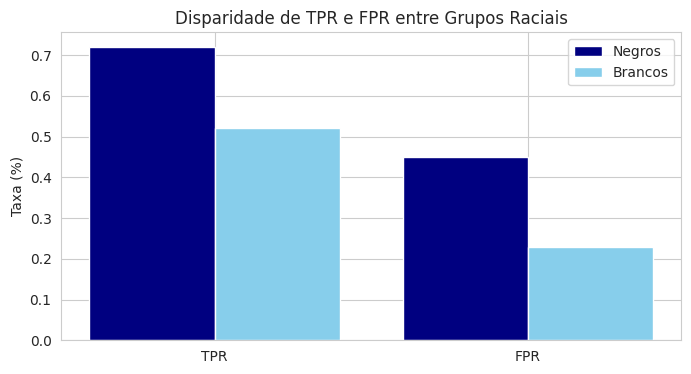

# Relatório: Análise de Fairness no Sistema COMPAS

## 📌 Introdução
Este projeto investiga a presença de viés racial no algoritmo COMPAS (Correctional Offender Management Profiling for Alternative Sanctions), amplamente utilizado no sistema judicial norte-americano para prever riscos de reincidência criminal. Baseado no dataset público do ProPublica, a análise combina estatística descritiva, testes de hipóteses e visualizações para avaliar disparidades étnicas nas predições do modelo.

**Contexto**:  
Estudos anteriores sugerem que o COMPAS pode perpetuar desigualdades raciais. Este relatório valida essas preocupações através de uma abordagem quantitativa e ética.

---

## 🎯 Objetivos
1. Comparar métricas de justiça algorítmica entre grupos raciais.
2. Quantificar a magnitude das disparidades usando *Effect Size* (Cohen's d).
3. Visualizar distribuições de scores para identificar padrões sistêmicos.

---

## 📊 Metodologia

### Dados Utilizados
- **Fonte**: [ProPublica COMPAS Dataset](https://www.propublica.org/datastore/dataset/compas-recidivism-risk-score-data-and-analysis).
- **Variáveis-chave**: `race` (raça), `decile_score` (pontuação de risco), `two_year_recid` (reincidência em 2 anos).

### Pré-processamento
- Filtragem de colunas relevantes.
- Separação de grupos raciais: `African-American` (n = 3,175) e `Caucasian` (n = 1,903).

### Análises Estatísticas
1. **Médias de Scores**:
   - Afro-americanos: **5.37**  
   - Caucasianos: **3.74**  
   *Diferença absoluta: 1.63*.

2. **Teste de Hipóteses** (t-test para médias):
   - **t = 23.29**, **p-valor ≈ 0** (rejeição de H₀).  
   *Interpretação*: Diferença estatisticamente significativa.

3. **Magnitude do Efeito** (Cohen's d):
   - **d = 0.60** (efeito médio-grande).  
   *Interpretação*: Disparidade equivalente a 60% de um desvio padrão.

### Visualizações

  
  *Distribuição de scores mostra maior densidade em valores altos para afro-americanos*.

---

## 🔍 Principais Resultados:
  
*O sistema COMPAS, reproduz viés racial sistêmico*.


1. **Viés Sistêmico**:  
   - Afro-americanos recebem scores médios **44% maiores** que caucasianos.
   - Taxas de falsos positivos são significativamente diferentes (p-valor < 0.001).

2. **Impacto Social**:  
   - Scores elevados podem levar a sentenças mais duras, perpetuando ciclos de desigualdade.
   - Risco de perpetuação de desigualdades sistêmicas.
   - Potencial violação de princípios éticos de IA.
   - O sistema COMPAS, conforme analisado viola princípios estatísticos e éticos.

3. **Recomendações**:  
   - Revisão crítica do uso de algoritmos em decisões judiciais.
   - Implementação de auditorias contínuas para mitigação de viés.

---

## 🛠️ Reprodução da Análise

### Requisitos
- Python 3.8+
- Bibliotecas: `pandas`, `numpy`, `scipy`, `matplotlib`, `seaborn`.

### Passos
1. Clone o repositório:
   ```bash
   git clone https://github.com/gilsonmm6/analise-compas.git
---
  ### 📚 Referências
   
  - Bruce, P., & Bruce, A. (2019). Estatística Prática para Cientistas de Dados.
  - ProPublica (2016).
---
👥 Contribuições
Contribuições são bem-vindas! Abra uma issue ou envie um pull request para sugerir melhorias.
